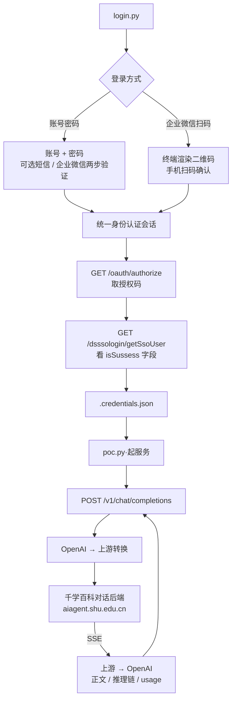

<div align="center">

# SHU DeepSeek POC

上海大学校内 DeepSeek 服务（千学百科，`ds.shu.edu.cn`）的 OpenAI 兼容代理

[](https://www.python.org/)
[](https://platform.openai.com/docs/api-reference)
[](LICENSE)

</div>

---

## 流程解析



整体流程：**认证 → 换 ds 会话 → 产出凭据 → 起服务**。
其中 ① ② ③ 均在 `login.py` 内完成、全程只需一次，之后 `poc.py` 用凭据长期提供服务。

千学百科的 Web 端在 `ds.shu.edu.cn`，是纯前端 SPA（对任何路径都返回同一份 `index.html`），
身份与令牌由该站**后端**接口下发；对话请求由 `aiagent.shu.edu.cn` 上的分享链承接。
`login.py` 走完整条链路取回凭据，`poc.py` 只用其中的分享链与 ds 用户信息访问对话接口。

| 文件 | 职责 |
| :--- | :--- |
| `login.py` | 认证 → 换 ds 会话 → 写出 `.credentials.json` |
| `poc.py` | 读凭据 → 起 OpenAI 兼容服务（默认 `127.0.0.1:3000`） |
| `sso/` | 登录环节的薄适配层；统一身份认证实现在 git 子模块 [`vendor/shu-sso-poc/`](vendor/shu-sso-poc/) |
| `proxy/` | OpenAI ↔ 上游转换与 HTTP 服务 |

> `sso/` 只保留本项目改动过的文件（`client` 子类、`config`、`runner`、`ui`、`utils`）；
> `qr`、`registry`、`rsa_key`、`system_api` 通过 `sys.modules` 别名直接复用子模块，只有一份实现，
> 因此上游更新不会与本地改动冲突。详见 [`sso/__init__.py`](sso/__init__.py)。

### ① 认证：建立统一身份认证会话

| 步骤 | 端点 | 说明 |
| :--- | :--- | :--- |
| 登录 | `POST /oauth/userLogin` | 账号 + 密码（RSA PKCS#1 v1.5 加密后 base64 提交） |
| 发码 | `POST /oauth/twoStep/send` | `method` 取 `wecom` / `sms` |
| 校验 | `POST /oauth/twoStep/verify` | 校验通过即建立可复用的认证会话 |

账号密码（可叠加短信或企微两步验证）与企业微信扫码两条路径，均在终端内完成 ——
扫码方式直接用半块字符渲染二维码，不必打开浏览器。

这一步由子模块 [shu-sso-poc](https://github.com/preca-hoshino/shu-sso-poc) 。

### ② 换会话：ds（千学百科）

ds 的 Web 端是纯前端 SPA，换会话由它的**后端**接口完成 —— 前端只把 `code` 递过去：

```text
① GET {认证站点}/oauth/authorize
        ?response_type=code&client_id=<ds 的 client_id>
        &redirect_uri=https://ds.shu.edu.cn/login          ← 无 state、无 scope
② 302 → https://ds.shu.edu.cn/login?code=...
③ GET https://ds.shu.edu.cn/dsssologin/getSsoUser
        ?code=<授权码>&url=https://ds.shu.edu.cn/login
   ← {"isSussess": true, "datas": "{\"userid\": ...}"}     ← 判定依据
```

| 项 | 值 |
| :--- | :--- |
| `client_id` | `re0owG1g776ng2eix7x3o8sa20W6OdA2` |
| `redirect_uri` | `https://ds.shu.edu.cn/login` |
| `scope` | 空（不发送） |
| `state` | 不传（前端直接拼 URL） |

实测约束：

- **字段名确实拼作 `isSussess`**（少一个 s）—— 代码按原样比对，不要「纠正」；
- **`datas` 是 JSON 字符串而非对象** —— 前端写的是 `JSON.parse(u.datas)`，本项目同样二次解析；
- **`url` 必须与授权时的 `redirect_uri` 完全一致**，否则判 `invalid_grant`；
- **ds 的会话不在 Cookie 里** —— 返回的 `userid` 才是关键；`datas` 中一并带出学号、姓名
  与 `accessToken` / `privatekey`（原样带进上游请求的 `variables`）。

### ③ 产出：凭据文件

`.credentials.json`（权限 `0600`，已在 `.gitignore`）：

```jsonc
{
  "version": 1,
  "created_at": "2026-09-23T18:30:00",
  "username": "25123368",
  "display_name": "同学",
  "upstream": { "base": "https://aiagent.shu.edu.cn",
                "chat_path": "/api/v2/chat/completions" },
  "share_id": "49imnzpquhvt2gnj8xqxmcch",
  "cookie_header": "SHU_OAUTH2=...",                       // 上游请求直接用这串
  "cookies": { "...": "..." },
  "ds": { "userid": "25123368", "name": "同学",
          "access_token": "...", "private_key": "...", "raw": {} }
}
```

`cookie_header` 是发给对话接口的那一串；`ds` 段是换会话时 ds 后端返回的用户信息，
其中 `userid` 用作上游 `variables.userId`，`access_token` / `private_key` 一并带上。

实测约束：**上游对话接口不校验 Cookie** —— 用真实 Cookie、编造 Cookie
（`uname=x; _webvpn_key=demo`）、完全不带 Cookie 发同一请求，三种都返回 HTTP 200。
真正起作用的是公开分享链（`shareId`）与请求形状（`Referer` / `variables`），
因此登录侧拿到分享链与 ds 用户信息即可，不必再去引导上游会话。
要确认手上这份凭据还能用，直接 `python login.py --check`（真发一次最小请求）。

### 关键结论

1. **一次登录、长期复用** —— ① ② ③ 只在 `login.py` 里跑一次，产出的凭据供 `poc.py` 长期使用；
   失效后上游会报错（状态码原样透传），重新 `python login.py` 即可；
2. **各环节互不影响** —— ds 换会话失败不影响认证会话本身，`login.py` 仍会写出凭据以便排查；
   上游对话接口报错只影响当次请求（分别见 `sso/runner.py` 的 `login_all_systems()`
   与 [`proxy/upstream.py`](proxy/upstream.py) 的 `UpstreamError`）；
3. **API 面严格等于 OpenAI 规范** —— 只暴露两个端点，字段、错误体、SSE 帧序列一律照规范，
   不出现任何自造字段（[`tests/test_offline.py`](tests/test_offline.py) 有
   `set(resp) == RESPONSE_KEYS` 一类断言兜着）；
4. **两处边界由上游决定** —— 原生 function calling 与思维链都取决于上游那个应用的配置：
   前者实测不可得（上游是应用级接口，`tools` 无处可传），后者上游当前不输出；
   代理侧已把支持做满，分别见「`reasoning_content`」与「上游的原生 tool call / MCP」两节。

---

## 快速开始

### 环境要求

| 项 | 要求 |
| :--- | :--- |
| Python | 3.10 或更高（实测 3.12） |
| 依赖 | 见 `requirements.txt`（FastAPI / httpx / requests / cryptography 等） |
| 网络 | 可访问认证站点、`ds.shu.edu.cn` 与 `aiagent.shu.edu.cn`（校外经 WebVPN 时用 `--base` 换域名） |

### 安装

```bash
# 拉代码（带子模块；忘了 --recurse-submodules 就补一条 update）
git clone --recurse-submodules https://github.com/preca-hoshino/shu-ds-poc.git
cd shu-ds-poc
# 已经克隆过的话：
git submodule update --init --recursive

python -m venv .venv && .venv\Scripts\activate      # Windows
pip install -r requirements.txt
```

### 使用

```bash
# ① 登录，生成凭据（详见「流程解析」①②③）
python login.py                    # 交互式选登录方式
python login.py --login wecom_scan # 或直接企微扫码

# ② 起服务
python poc.py                      # 默认 127.0.0.1:3000
```

然后任何 OpenAI 客户端都能直连：

```python
from openai import OpenAI

client = OpenAI(base_url="http://127.0.0.1:3000/v1", api_key="sk-shu-secret-key-12345")

# 非流式
resp = client.chat.completions.create(
    model="deepseek-r1",
    messages=[{"role": "user", "content": "用三句话介绍上海大学"}],
)
print(resp.choices[0].message.content)

# 流式
stream = client.chat.completions.create(
    model="deepseek-r1",
    messages=[{"role": "user", "content": "你好"}],
    stream=True,
)
for chunk in stream:
    print(chunk.choices[0].delta.content or "", end="")
```

---

## API

### 端点

只有两个，除此之外**没有任何路由**（`/`、`/healthz`、`/docs`、`/redoc`、`/openapi.json`
全部 404）—— 规范里用不上的端点一律不开：

| 方法 | 路径 | 说明 |
| :--- | :--- | :--- |
| `POST` | `/v1/chat/completions` | 对话（`stream: true` 走 SSE） |
| `GET` | `/v1/models` | 模型列表 |

### 鉴权

```
Authorization: Bearer <api key>
```

Key 取 `--api-key`，缺省读环境变量 `PROXY_API_KEY`，再缺省用 `sk-shu-secret-key-12345`。

### 模型

| 请求里的名字 | 归一到 | 说明 |
| :--- | :--- | :--- |
| `deepseek-v3` | v3 | 默认分享链 |
| `deepseek-chat` | v3 | DeepSeek 官方叫法 |
| `deepseek-r1` | r1 | R1 独立分享链 |
| `deepseek-reasoner` | r1 | DeepSeek 官方叫法 |

名字不区分大小写；其它名字一律 404 `model_not_found`（与 OpenAI 一致），
响应的 `model` 字段**回显请求里的名字**。

### 请求字段

规范里定义的字段全部接受，但真正下发给上游的只有四个：

| 字段 | 下游效果 |
| :--- | :--- |
| `model` | 决定分享链（R1 走独立分享链） |
| `messages` | 原样转成上游 `messages`（**含 `system`，不做任何裁剪**） |
| `stream` | 上游 `stream` |
| `user` | 生成上游 `outLinkUid = shareChat-<user>` |

其余（`temperature` / `top_p` / `max_tokens` / `stop` / `n` / `seed` /
`response_format` / `logprobs` / `tools` / `tool_choice` …）**接受但不下发** ——
上游接口不接受这些参数，发过去只会被忽略或报错。它们在 [`proxy/schemas.py`](proxy/schemas.py)
里显式声明，便于对着规范核对；`tools` 也只做到「接受」，本代理**不实现工具循环**
（原因见「上游的原生 tool call / MCP」一节）。

规范之外的字段（供应商扩展）同样接受并忽略；用 `--log-level debug` 可以看到
哪些参数没生效（由 [`proxy/chat.py`](proxy/chat.py) 的 `_log_ignored()` 记录）。

`stream_options.include_usage` 按规范生效：流式响应末尾会多一个 usage 帧。

### 响应结构

非流式（字段与 OpenAI 完全一致）：

```jsonc
{
  "id": "chatcmpl-...",
  "object": "chat.completion",
  "created": 1790159602,
  "model": "deepseek-v3",                    // 回显请求值
  "choices": [{
    "index": 0,
    "message": {
      "role": "assistant",
      "content": "答案",
      "reasoning_content": "..."             // 见下方说明
    },
    "logprobs": null,
    "finish_reason": "stop"
  }],
  "usage": {
    "prompt_tokens": 2,
    "completion_tokens": 48,
    "total_tokens": 50,
    "prompt_tokens_details": {"cached_tokens": 0},
    "completion_tokens_details": {"reasoning_tokens": 0}
  }
}
```

流式帧序列（与 OpenAI 一致）：

```text
data: {"...","choices":[{"index":0,"delta":{"role":"assistant","content":""},"logprobs":null,"finish_reason":null}]}
data: {"...","choices":[{"index":0,"delta":{"reasoning_content":"先想…"},"logprobs":null,"finish_reason":null}]}   ← 上游有推理链才有
data: {"...","choices":[{"index":0,"delta":{"content":"天空"},"logprobs":null,"finish_reason":null}]}
...
data: {"...","choices":[{"index":0,"delta":{},"logprobs":null,"finish_reason":"stop"}]}
data: {"...","choices":[],"usage":{...}}      ← 仅当 stream_options.include_usage
data: [DONE]
```

### 错误结构

```jsonc
{"error": {"message": "...", "type": "...", "param": null, "code": "..."}}
```

| 场景 | HTTP | `type` | `code` | `param` |
| :--- | :--- | :--- | :--- | :--- |
| Key 缺失/错误 | 401 | `invalid_request_error` | `invalid_api_key` | `null` |
| 请求体非 JSON / 校验失败 | 400 | `invalid_request_error` | `null` | 出错字段路径 |
| 模型不存在 | 404 | `invalid_request_error` | `model_not_found` | `model` |
| 上游报错 | **沿用上游状态码** | `api_error` | `null` | `null` |
| 其它异常 | 500 | `server_error` | `null` | `null` |

上游原文会带在 `message` 里，方便直接读出「分享链失效 / 参数不对」这类原因。

---

## `reasoning_content` —— 思维链

`reasoning_content` 是 **DeepSeek 官方 API 定义的字段**（`deepseek-reasoner` 用它
返回推理链），不是本代理自造的，
因此原样保留并**尽力还原**。上游可能从四个位置给出推理链，四种都已支持：

| 上游形态 | 出现在 | 代理处理 |
| :--- | :--- | :--- |
| `content` 分段数组里的 `{"type":"reasoning","reasoning":{"content":"…"}}` | 非流式 | 归到 `message.reasoning_content` |
| `message.reasoning_content` 字段 | 非流式 | 同上（分段里已有推理时以分段为准，不重复） |
| `delta.reasoning_content` / `delta.content` 里的 reasoning 段 | 流式 | 原样转成 `delta.reasoning_content` 帧 |
| `flowNodeResponse`(chatNode) 的 `reasoningText` | 流式收尾 | 上游整段给、没有增量时，**在 `finish_reason` 帧之前补一帧** `reasoning_content` |

若上游两者都给了（增量 + 收尾统计），只用增量那份，不会重复。

**上游当前不给推理链（2026-09-23 实测）**：

- 两条分享链（V3 / R1）的非流式 `content` 都是**纯字符串**，没有 reasoning 段；
- 流式 `answer` 增量里只有 `content`，没有 `reasoning_content`；
- 收尾统计里的 `reasoningText` 恒为 `""` ——

所以正常情况下 `reasoning_content` 不会出现，`reasoning_tokens` 也是 0。
这是上游的行为，不是代理丢了数据；上游一旦改回上面任一形态，代理会自动归位
（[`tests/test_offline.py`](tests/test_offline.py) 与 [`tests/test_e2e_mock.py`](tests/test_e2e_mock.py)
里各形态都有用例兜着）。想复核就直连上游看原始帧：

```bash
python docs/scripts/probe_upstream_raw.py -m deepseek-r1 --stream    # 原始 SSE 帧
python docs/scripts/probe_upstream_raw.py --matrix                   # 两条链 × 流式/非流式 对照
```

`completion_tokens_details.reasoning_tokens` 一定有值：有真实 `completion_tokens`
时按「推理字符数 / 总字符数」的占比切分（DeepSeek 的总数本就含推理 token，
按占比切才自洽）；拿不到真实总数时按「字符数 × 2/3」估算。

### 流式细节（与上游的对应关系）

上游 SSE 只有三种事件，代理只转其中的增量：

| 上游事件 | 用途 | 代理是否下发 |
| :--- | :--- | :--- |
| `answer` | 正文 / 推理增量（`choices[0].delta`） | 是（转成 chunk） |
| `flowNodeResponse` | 节点统计：`chatNode` 帧带真实 token、`reasoningText`、`finishReason` | 否（用于 usage / 收尾） |
| `flowNodeStatus` | 节点状态（`"running"`） | 否（纯噪声） |

上游自己的收尾是「先发一帧 `delta: {"content": null}, finish_reason: "stop"`，再以
`event: answer` + `data: [DONE]` 结束」。代理不照抄，而是按规范自己构造收尾：
`delta: {}` + `finish_reason`（`stop`；上游 `finishReason` 为 `length` 时映射成 `length`）。

分片是**实时下发**的：上游逐帧到、代理逐帧转，不等整段收完（否则客户端会
「卡几秒后一次性蹦出全文」）。要确认这一点就跑 `docs/scripts/check_proxy_stream.py`，
看 `帧到达跳度` 是不是大于 0。

### usage 的真实性

| 场景 | 来源 |
| :--- | :--- |
| 流式（上游给了） | `flowNodeResponse` 中 `moduleType == "chatNode"` 帧里的 `inputTokens` / `outputTokens`，**是上游的真实值** |
| 流式（上游没给） | 「字符数 × 2/3」估算 |
| 非流式（上游给了） | 沿用上游 |
| 非流式（上游给的是占位值） | 改用估算 —— 实测上游非流式固定返回 `1/1/1`，与真实用量无关，沿用会对外给出明显错误的数字 |

---

## 命令行参数

### login.py

| 参数 | 默认值 | 说明 |
| :--- | :--- | :--- |
| `--tenant` | `上海大学` | 院校标识（`tenantId`） |
| `--login {password,wecom_scan}` | 交互选择 | 登录方式 |
| `--method {wecom,sms}` | 交互选择 | 账号密码模式下的两步验证方式 |
| `--scan-timeout` | `180` | 企微扫码等待秒数 |
| `--no-qr` | 关闭 | 不在终端渲染二维码 |
| `--qr-style {block,ascii}` | `block` | 二维码渲染样式 |
| `--out` | `.credentials.json` | 凭据输出路径 |
| `--base` | `https://aiagent.shu.edu.cn` | 上游站点根地址 |
| `--cookie "<串>"` | 无 | 手工粘贴 Cookie（跳过认证环节的兜底路径） |
| `--check` | 关闭 | 用已有凭据真发一次最小请求，确认还能用（不重新登录） |

### poc.py

| 参数 | 默认值 | 说明 |
| :--- | :--- | :--- |
| `--host` | `127.0.0.1` | 监听地址 |
| `--port` | `3000` | 监听端口 |
| `--api-key` | `$PROXY_API_KEY` | 本服务的 Key |
| `--credentials` | `.credentials.json` | 凭据文件路径 |
| `--base` | 凭据里的值 | 覆盖上游站点根地址 |
| `--timeout` | `300` | 上游超时秒数 |
| `--insecure` | 关闭 | 跳过上游 TLS 证书校验（默认校验） |
| `--log-level` | `info` | `debug` 会打印未生效的请求参数 |
| `--access-log` | 关闭 | 打印每条请求的访问日志 |

---

## 自测

### 离线（不联网，秒级）

```bash
.venv\Scripts\python.exe tests\test_offline.py      # 141 项：转换 / 解析 / 规范形状 / 推理链 / 帧序列 / 真流式 / 子模块契约
.venv\Scripts\python.exe tests\test_e2e_mock.py     # 69 项：HTTP 层 / 鉴权 / 错误体 / SSE
```

### 真机（需服务在跑）

```bash
python docs/scripts/test_nonstream.py          # 非流式
python docs/scripts/test_stream.py             # 流式（含 usage 与推理链提示）
python docs/scripts/test_openai_sdk.py         # 官方 OpenAI SDK 端到端（需 pip install openai）
python docs/scripts/check_proxy_stream.py --mimic cherry   # 流式体检：分片是否**实时**到达
```

### 直连上游的探针

绕过代理直接看上游真身，会用到 `.credentials.json`：

```bash
python docs/scripts/probe_upstream_raw.py -m deepseek-r1 --stream   # 原始 SSE 帧
python docs/scripts/probe_upstream_raw.py --matrix                  # 两条链 × 流式/非流式
python docs/scripts/probe_share_info.py --page                      # 分享页标题与应用线索
python docs/scripts/probe_toolcall.py                               # 接口面 / MCP 出口 / 模型能力
```

> **客户端（Cherry Studio 等）报「没有流式」时**，先跑 `check_proxy_stream.py` ——
> 它量的是**帧到达时间**：`帧到达跳度 > 0` 且 `TTFB < 总耗时` 才算真流式；
> 跳度 0 说明中间被缓冲了（httpx 便捷方法预读、或中间层攒包）。

---

## 已知约束

| 约束 | 说明 |
| :--- | :--- |
| 凭据会失效 | 取决于分享链是否还在（Cookie 上游不校验）；失效后上游报错、状态码原样透传，`login.py --check` 可确诊，重新 `python login.py` 即可 |
| 只有一个 choice | 上游只返回单条回复，`n > 1` 接受但无效 |
| 不做多轮会话记录 | 上游 `chatId` 恒为空串，每次请求相互独立 |
| 部分规范参数无效 | `temperature` / `max_tokens` 等上游接口不接受，发了也不起作用（见「请求字段」） |
| 只在校内网直连下验证 | 校外经 WebVPN 时用 `--base` 换成反代域名，映射规则 `<scheme>-<主机名 . 换成 ->-<端口>.webvpn.shu.edu.cn` |
| 仅限个人学习研究 | 请遵守学校的信息系统使用规定与上游服务条款 |

## License

AGPL-3.0
