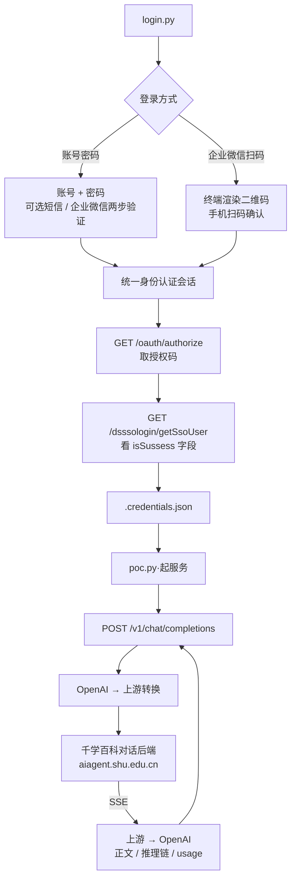

<div align="center">

# SHU DeepSeek POC

上海大学校内 DeepSeek 服务（千学百科，`ds.shu.edu.cn`）的 OpenAI 兼容代理

[](https://www.python.org/)
[](https://platform.openai.com/docs/api-reference)
[](LICENSE)

</div>

---

## 流程解析



整体流程：**认证 → 换 ds 会话 → 产出凭据 → 起服务**。
其中 ① ② ③ 均在 `login.py` 内完成、全程只需一次，之后 `poc.py` 用凭据长期提供服务。

千学百科的 Web 端在 `ds.shu.edu.cn`，是纯前端 SPA（对任何路径都返回同一份 `index.html`），
身份与令牌由该站**后端**接口下发；对话请求由 `aiagent.shu.edu.cn` 上的分享链承接。
`login.py` 走完整条链路取回凭据，`poc.py` 只用其中的分享链与 ds 用户信息访问对话接口。

| 文件 | 职责 |
| :--- | :--- |
| `login.py` | 认证 → 换 ds 会话 → 写出 `.credentials.json` |
| `poc.py` | 读凭据 → 起 OpenAI 兼容服务（默认 `127.0.0.1:3000`） |
| `sso/` | 登录环节的薄适配层；统一身份认证实现在 git 子模块 [`vendor/shu-sso-poc/`](vendor/shu-sso-poc/) |
| `proxy/` | OpenAI ↔ 上游转换与 HTTP 服务 |

> `sso/` 只保留本项目改动过的文件（`client` 子类、`config`、`runner`、`ui`、`utils`）；
> `qr`、`registry`、`rsa_key`、`system_api` 通过 `sys.modules` 别名直接复用子模块，只有一份实现，
> 因此上游更新不会与本地改动冲突。详见 [`sso/__init__.py`](sso/__init__.py)。

详细链路（① 认证 → ② 换 ds 会话 → ③ 产出凭据）与关键结论见 [`docs/login.md`](docs/login.md)。

---

## 快速开始

### 环境要求

| 项 | 要求 |
| :--- | :--- |
| Python | 3.10 或更高（实测 3.12） |
| 依赖 | 见 `requirements.txt`（FastAPI / httpx / requests / cryptography 等） |
| 网络 | 可访问认证站点、`ds.shu.edu.cn` 与 `aiagent.shu.edu.cn`（校外经 WebVPN 时用 `--base` 换域名） |

### 安装

```bash
# 拉代码（带子模块；忘了 --recurse-submodules 就补一条 update）
git clone --recurse-submodules https://github.com/preca-hoshino/shu-ds-poc.git
cd shu-ds-poc
# 已经克隆过的话：
git submodule update --init --recursive

python -m venv .venv && .venv\Scripts\activate      # Windows
pip install -r requirements.txt
```

### 使用

```bash
# ① 登录，生成凭据（详见 docs/login.md）
python login.py                    # 交互式选登录方式
python login.py --login wecom_scan # 或直接企微扫码

# ② 起服务
python poc.py                      # 默认 127.0.0.1:3000
```

然后任何 OpenAI 客户端都能直连：

```python
from openai import OpenAI

client = OpenAI(base_url="http://127.0.0.1:3000/v1", api_key="sk-shu-secret-key-12345")

# 非流式
resp = client.chat.completions.create(
    model="deepseek-r1",
    messages=[{"role": "user", "content": "用三句话介绍上海大学"}],
)
print(resp.choices[0].message.content)

# 流式
stream = client.chat.completions.create(
    model="deepseek-r1",
    messages=[{"role": "user", "content": "你好"}],
    stream=True,
)
for chunk in stream:
    print(chunk.choices[0].delta.content or "", end="")
```

更多用法（模型列表、请求字段、工具调用、思维链、命令行参数、自测）见下方[文档](#文档)。

---

## 文档

各专题文档在 [`docs/`](docs/) 下，README 只保留概览、快速开始与已知约束：

| 文档 | 内容 |
| :--- | :--- |
| [`docs/login.md`](docs/login.md) | 登录链路：① 认证 → ② 换 ds 会话 → ③ 产出凭据，以及关键结论 |
| [`docs/api.md`](docs/api.md) | 接口面：端点 / 鉴权 / 模型 / 请求字段 / 响应结构 / 错误结构 |
| [`docs/reasoning.md`](docs/reasoning.md) | `reasoning_content` 思维链、流式细节、usage 真实性 |
| [`docs/tool-calling.md`](docs/tool-calling.md) | 提示词模式的工具调用与规模压测 |
| [`docs/cli.md`](docs/cli.md) | `login.py` / `poc.py` 命令行参数 |
| [`docs/testing.md`](docs/testing.md) | 离线自测、真机测试、直连上游探针 |

---

## 已知约束

| 约束 | 说明 |
| :--- | :--- |
| 凭据会失效 | 取决于分享链是否还在（Cookie 上游不校验）；失效后上游报错、状态码原样透传，`login.py --check` 可确诊，重新 `python login.py` 即可 |
| 只有一个 choice | 上游只返回单条回复，`n > 1` 接受但无效 |
| 不做多轮会话记录 | 上游 `chatId` 恒为空串，每次请求相互独立 |
| 部分规范参数无效 | `temperature` / `max_tokens` 等上游接口不接受，发了也不起作用（见 [`docs/api.md`](docs/api.md)） |
| 工具调用是提示词模拟 | 非原生 function calling：`parallel_tool_calls` / 强制 `tool_choice` 都不支持，工具越多越不稳（见 [`docs/tool-calling.md`](docs/tool-calling.md)） |
| 只在校内网直连下验证 | 校外经 WebVPN 时用 `--base` 换成反代域名，映射规则 `<scheme>-<主机名 . 换成 ->-<端口>.webvpn.shu.edu.cn` |
| 仅限个人学习研究 | 请遵守学校的信息系统使用规定与上游服务条款 |

## License

AGPL-3.0
